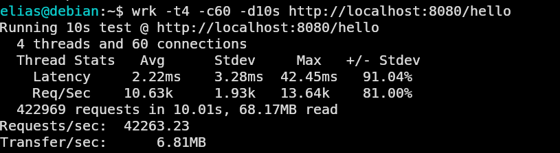

## Performance Benchmark

Benchmark tool: wrk  
Machine: Debian Linux  
Duration: 10 seconds  
Connections: 5  

| Framework | Requests/sec |
|----------|-------------|
| FastAPI | ~4k |
| Starlette | ~8k |
| Sanic | ~28k |
| Tornado | ~5k |
| Flask | ~6k |
| MachPoint | **~40k** |

MachPoint achieves significantly higher throughput by delegating HTTP networking to Go's fasthttp while exposing a Python developer interface.

